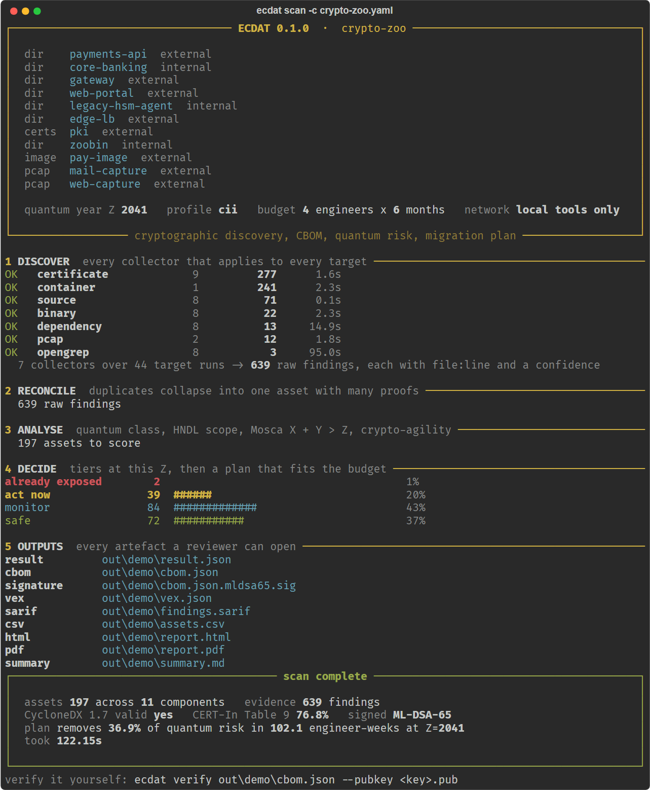
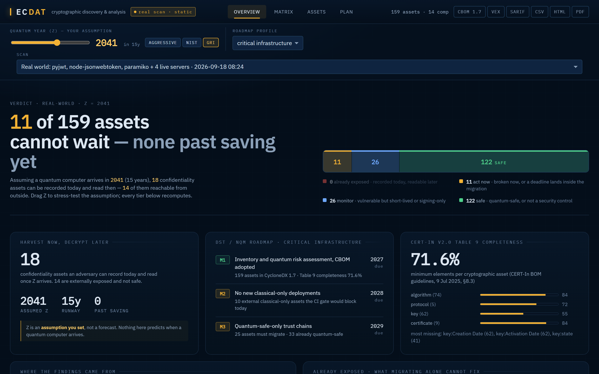
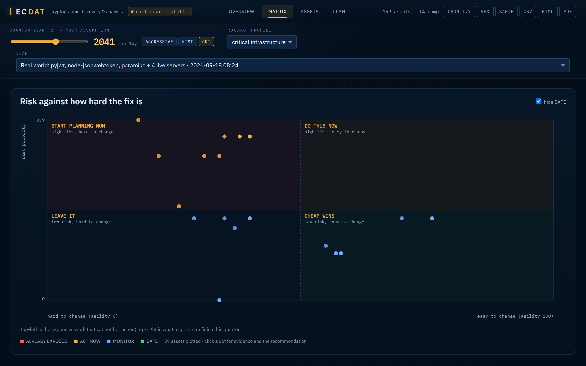
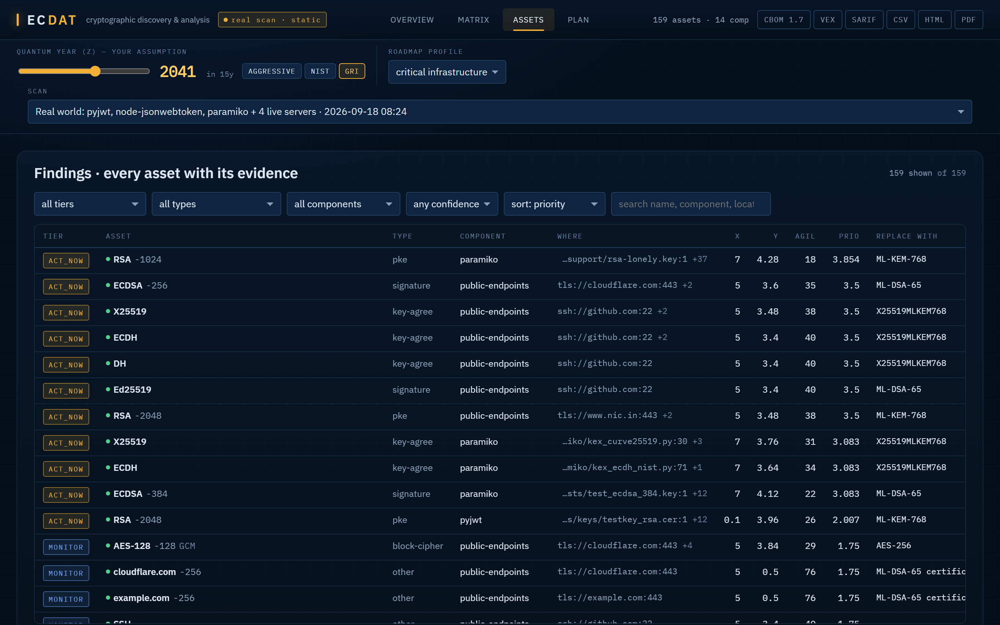
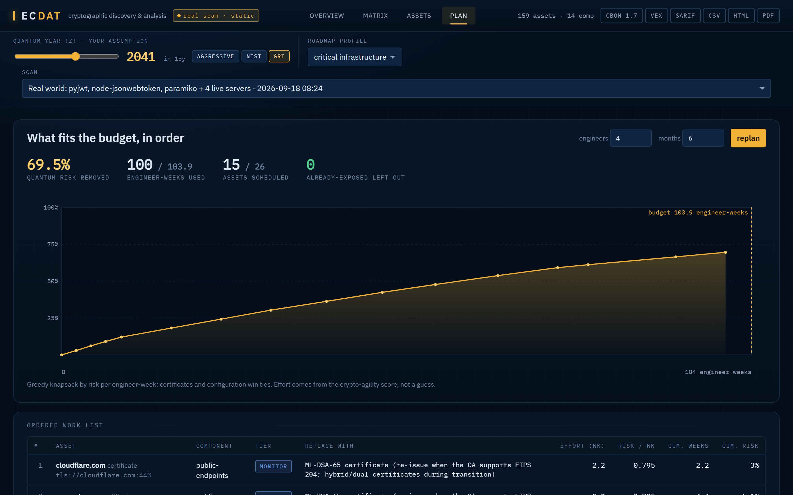

# ECDAT — Enterprise Cryptographic Discovery & Analysis Tool

**SIH 2026 · PS 26164 · NTRO · Blockchain & Cybersecurity**

We built ECDAT to answer three questions about an organisation's cryptography: **where is it**, **which of it
breaks when a quantum computer arrives**, and **what do we fix first with the engineers we actually have**.

It scans source repositories, dependency manifests, certificates and keystores, binaries, container images, live
TLS/SSH endpoints and packet captures; reconciles everything into one **signed CycloneDX 1.7 CBOM**; scores every
asset (HNDL-aware Mosca inequality, crypto-agility, framework deadlines); and turns that into a **budgeted
migration plan** with PQC/hybrid targets, VEX statements and patch suggestions. It runs fully offline.

**[Evidence hub](https://sarthakshrivastav-a.github.io/ecdat/)** ·
[CBOM Atlas — 109 signed CBOMs](https://sarthakshrivastav-a.github.io/ecdat/atlas) ·
[India readiness snapshot](https://sarthakshrivastav-a.github.io/ecdat/snapshot) ·
[Live dashboard](https://sarthakshrivastav-a.github.io/ecdat/dashboard)

---

## One command, five phases

```bash
ecdat scan -c ecdat.yaml -o out/run
```



That is a real run against `tests/fixtures/zoo/` — eleven targets across six surfaces, 639 raw findings reconciled
into 197 assets, CycloneDX 1.7 schema-valid, ML-DSA-65 signed, with a plan that removes 36.9% of the quantum risk
inside a 4-engineer × 6-month budget. `ECDAT_RECORD_SVG=scan.svg` records the session as an SVG terminal window.

## What it finds

| Collector | Input | Engine | Notes |
|---|---|---|---|
| source | Python, Java/Kotlin, Go, JS/TS, C/C++ (+ regex fallback for 15 more) | tree-sitter call-site analysis driven by `ecdat/knowledge/source_patterns.yaml` | key sizes, modes, padding, curves, imports; comments and tests are flagged, not hidden |
| opengrep | same | OpenGrep 1.29 + 151 crypto rules from semgrep-rules | optional second opinion; corroboration raises confidence |
| dependency | requirements / pyproject / package.json / lock files / go.mod / pom / gradle / Cargo / Gemfile / composer | manifest parsers + Syft (optional) | libraries become CBOM components with `provides` edges; runtime PQC availability (Go 1.24+, JDK 24+, OpenSSL 3.5+) |
| certificate | PEM / DER / PKCS#12 / JKS / OpenSSH keys | pyca cryptography, pyjks, cbomkit-theia (optional) | every CERT-In Table 9 field is populated |
| binary | ELF / PE / Mach-O / .so / .dll / JAR / firmware blobs | YARA findcrypt3 constants, LIEF symbols/imports, version strings, Go import paths | **best-effort, medium confidence at most** |
| container | docker-save / OCI tars, OCI layout dirs, registry refs via crane (optional) | layer extraction with whiteouts, then the file collectors on the rootfs | no Docker daemon needed |
| protocol | live `host:port tls\|ssh\|smtp\|imap\|pop3` | CryptoLyzer + ssl handshake + a raw ClientHello offering X25519MLKEM768 | detects post-quantum key exchange on the wire; SSH KEXINIT parsing |
| pcap | packet captures | scapy TLS handshake reconstruction, STARTTLS upgrades, tshark cross-check (optional) | reads what was actually negotiated |

## The dashboard

Everything below runs on real scans — 159 assets from pyjwt, node-jsonwebtoken, paramiko and four live servers.
Each view deep-links: `#overview`, `#matrix`, `#assets`, `#plan`.

| The verdict at this Z | Risk against how hard the fix is |
|---|---|
|  |  |
| Drag the quantum-year slider and every tier recomputes. The ribbon is the filter. | Top-left is expensive work that cannot be rushed; top-right is what a sprint can finish. |

| Every finding, with its evidence | What fits the budget, in order |
|---|---|
|  |  |
| X = years the data must stay secret, Y = years to change it. Click any row for the file:line that proved it. | Greedy knapsack by risk per engineer-week, against a budget you set. |

## What it emits

`result.json` · `cbom.json` (CycloneDX 1.7, schema-validated) + `cbom.json.mldsa65.sig` (ML-DSA-65 detached
signature) + `ecdat-mldsa65.pub` · `vex.json` · `findings.sarif` · `assets.csv` · `report.html` · `report.pdf` ·
`summary.md`, plus a CI gate (`ecdat gate`) that fails a build on new classical-only crypto.

Nothing asks you to trust us — check any CBOM we publish:

```bash
curl -O https://sarthakshrivastav-a.github.io/ecdat/ecdat-mldsa65.pub
ecdat verify cbom.json --pubkey ecdat-mldsa65.pub
# OK  cbom.json  ML-DSA-65 (FIPS 204) sha256 21be1f01...  trusted key
```

## Evidence we published

- **[CBOM Atlas](https://sarthakshrivastav-a.github.io/ecdat/atlas)** — we pointed the tool at **109 public
  codebases**, including India's open digital public infrastructure. Every CBOM, signature, report and VEX file is
  downloadable, and 37 s is the median scan.
- **[India quantum-readiness snapshot](https://sarthakshrivastav-a.github.io/ecdat/snapshot)** — we probed **132
  public sites** across NCIIPC's seven critical sectors; 18.9% negotiate post-quantum key exchange against 56.0% of
  our global reference set. Sector totals only; we name no site.
- **[Dashboard](https://sarthakshrivastav-a.github.io/ecdat/dashboard)** — the real thing on the real scans.

## How risk is scored

- **Quantum class** from `ecdat/knowledge/algorithms.yaml`: Shor-broken (RSA, ECC, DH, DSA), Grover-weakened
  (AES-128, SHA-224), legacy-broken (MD5, SHA-1, DES, 3DES, RC4, RSA < 2048), safe (AES-256, SHA-384+, ML-KEM,
  ML-DSA, SLH-DSA, hybrids).
- **Context**: MD5 as a cache key is not a password hash. Usage is voted across all evidence: security /
  non-security / test / comment.
- **Mosca's inequality** `X + Y > Z`, only for confidentiality primitives — harvest-now-decrypt-later cannot apply
  to signatures. X = data lifetime from the data class, Y = migration time from the agility score, Z = the CRQC
  year (slider; presets aggressive 2032 / NIST-disallow 2035 / GRI-median 2041).
- **Tiers**: EXPOSED (X + Y > Z *and* Shor-broken — migration alone no longer saves this data), ACT_NOW, MONITOR, SAFE.
- **Agility** (0..100) over seven dimensions: algorithm/provider/parameter coupling, decoupling mechanism, spread,
  ownership, runtime PQC.
- **Overlays**: DST/NQM India milestones (CII 2027/2028/2029, enterprise 2028/2030/2033), CERT-In BOM v2.0,
  NIST IR 8547, CNSA 2.0, EU, UK NCSC.
- **Plan**: greedy knapsack by priority per engineer-week under the given budget; PQC targets are hybrid-first
  (X25519MLKEM768, ML-DSA-65).

## Install

```powershell
python -m venv .venv
.\.venv\Scripts\python -m pip install -e . --no-deps
.\.venv\Scripts\python -m pip install cryptography cyclonedx-python-lib lief scapy "tree-sitter>=0.25" tree-sitter-python tree-sitter-javascript tree-sitter-java tree-sitter-go tree-sitter-c yara-python fastapi "uvicorn[standard]" pyyaml typer rich jsonschema reportlab dilithium-py kyber-py httpx python-multipart cryptolyzer pycryptodomex pyasn1 pyasn1-modules javaobj-py3
.\.venv\Scripts\python -m pip install --no-deps pyjks      # pyjks pulls in a C extension (twofish) that is not needed
```

Optional engines (auto-detected in `tools/`, `%USERPROFILE%\go\bin`, or PATH; everything works without them):
OpenGrep (`tools/opengrep.exe`), Syft (`tools/syft.exe`), cbomkit-theia and crane
(`go install github.com/cbomkit/cbomkit-theia@latest`, `go install github.com/google/go-containerregistry/cmd/crane@latest`),
Wireshark's tshark. `ecdat tools` shows what was found. Air-gapped installation: [`docs/AIRGAP_INSTALL.md`](docs/AIRGAP_INSTALL.md).

## Use

```powershell
ecdat zoo build                                   # generate the evaluation corpus (certs, keystores, binary, image tar, pcaps)
ecdat scan -c tests/fixtures/zoo/ecdat.yaml -o out/zoo
ecdat evaluate out/zoo/result.json                # precision / recall against tests/fixtures/zoo/truth.yaml
ecdat recompute out/zoo/result.json --z-year 2032 --engineers 2 --months 3
ecdat report out/zoo/result.json --format html -o report.html
ecdat gate -c ecdat.yaml --baseline cbom-baseline.json --policy dst-m2
ecdat serve out                                   # API + dashboard on http://127.0.0.1:8787
```

Config (`ecdat.yaml`):

```yaml
name: payments-estate
params: {z_year: 2041, engineers: 4, months: 6, profile: cii}      # profile: cii | enterprise (DST milestone dates)
targets:
  - {kind: dir, path: services/payments, name: payments-api, zone: external, data_class: financial, criticality: high}
  - {kind: certs, path: pki/, name: pki, zone: external, passwords: [changeit]}
  - {kind: image, path: images/pay.tar, name: pay-image, zone: external}
  - {kind: endpoints, name: edge, zone: external, endpoints: ["pay.example.in:443 tls", "bastion.example.in:22 ssh"]}
  - {kind: pcap, path: captures/mail.pcap, name: mail}
```

## Evaluation

`tests/fixtures/zoo/` is a planted corpus (5 languages, config files, certs/keystores, a synthetic .so and a Go
binary, an OCI image tar, two pcaps). Against `truth.yaml` the current build scores precision 1.0 / recall 1.0
(60 planted assets, 26 legitimate extras whitelisted). We wrote the truth file after inspecting the tool's own
output, so treat it as a regression benchmark rather than a blind one; real-repo results are in
[`docs/REAL_RUNS.md`](docs/REAL_RUNS.md).

## What we do not claim

Every finding carries its confidence and its evidence. Binary findings prove presence, not use, and are capped at
medium confidence. An algorithm a dependency merely *can* provide is inventoried but never counted as use. Z is an
assumption you set, not a forecast we make. Mosca applies only where it applies. Patches are suggestions with
evidence attached — we never apply them for you. Every engine we compose is named in every report.

## Tests

```powershell
.\.venv\Scripts\python -m pytest -q -p no:warnings
```

## Layout

```
ecdat/knowledge/*.yaml   all crypto knowledge (algorithms, library signatures, source patterns, PQC mappings, data classes, frameworks)
ecdat/collectors/        source, opengrep, dependency, certificate, binary, container, protocol, pcap
ecdat/normalize/         merge -> CryptoAsset, CycloneDX 1.7 emitter + validation, ML-DSA signing, CERT-In Table 9
ecdat/enrich/            context, exposure, lifetime, agility
ecdat/risk/              quantum class, Mosca tiers, framework overlays
ecdat/plan/              PQC recommendations, knapsack optimiser, VEX, patches
ecdat/export/            SARIF, CSV, HTML, PDF
ecdat/tui.py             how a scan looks while it runs
ecdat/pipeline.py, cli.py, gate.py, evaluation.py, api/server.py
web/                     React + Vite dashboard (build with `npm run build`; served by `ecdat serve`)
scripts/                 build_zoo.py, prepare_rules.py, fetch_real.py, atlas.py, survey.py, build_site.py
```
